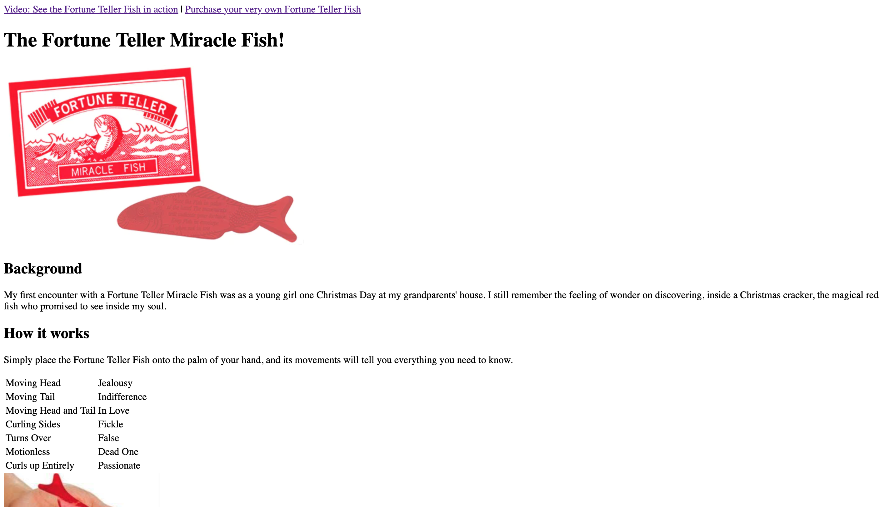

# Code First Girls Web Development Course

This is my second homework assignment for week 1 of the Code First Girls (https://codefirstgirls.com) Web Dev course.

### The brief

To produce a two-page HTML website on any topic containing specified HTML elements.

### Screenshot

### Links

- Repository URL: https://github.com/jengori/miracle_fish
- Live Site URL: https://jengori.github.io/miracle_fish/